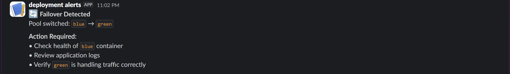
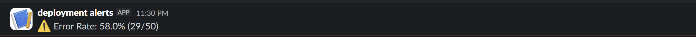
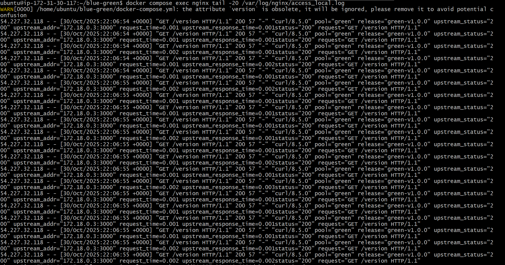

# Blue/Green Deployment with Monitoring & Slack Alerts

Automated monitoring and alerting system for Blue/Green deployment with Nginx failover.

## Prerequisites

- Docker & Docker Compose
- Slack workspace with incoming webhook configured
- Container images deployed to registry

## Setup Instructions

### 1. Clone and Configure
```bash
git clone 
cd blue-green-deployment
cp .env.example .env
```

### 2. Set Up Slack Webhook

1. Go to https://api.slack.com/messaging/webhooks
2. Create a new incoming webhook
3. Copy the webhook URL
4. Update `.env`:
```bash
SLACK_WEBHOOK_URL=https://hooks.slack.com/services/YOUR/WEBHOOK/URL
```

### 3. Start Services
```bash
docker-compose up -d
```

### 4. Verify Deployment
```bash
# Check all services are running
docker-compose ps

# Test the endpoint
curl -i http://localhost:8080/version

# Should show:
# X-App-Pool: blue
# X-Release-Id: blue-v1.0.0
```

## Configuration

### Environment Variables (.env)

| Variable | Default | Description |
|----------|---------|-------------|
| ACTIVE_POOL | blue | Active pool (blue/green) |
| BLUE_IMAGE | - | Blue app Docker image |
| GREEN_IMAGE | - | Green app Docker image |
| RELEASE_ID_BLUE | - | Blue release identifier |
| RELEASE_ID_GREEN | - | Green release identifier |
| SLACK_WEBHOOK_URL | - | Slack incoming webhook URL |
| ERROR_RATE_THRESHOLD | 2 | Error % that triggers alerts |
| WINDOW_SIZE | 200 | Requests to analyze |
| ALERT_COOLDOWN_SEC | 300 | Seconds between alerts |
| MAINTENANCE_MODE | false | Suppress failover alerts |

## Testing

### Test 1: Automatic Failover Alert
```bash
# 1. Verify Blue is active
curl -i http://localhost:8080/version

# 2. Induce failure on Blue
curl -X POST http://localhost:8081/chaos/start?mode=error

# 3. Generate traffic to trigger failover
for i in {1..20}; do 
  curl -s http://localhost:8080/version | grep -o 'X-App-Pool: [a-z]*'
  sleep 0.5
done

# 4. Check Slack for failover alert

# 5. Verify Green is now serving
curl -i http://localhost:8080/version

# 6. Clean up
curl -X POST http://localhost:8081/chaos/stop
```

### Test 2: High Error Rate Alert
```bash
# 1. Start chaos on BOTH pools
curl -X POST http://localhost:8081/chaos/start?mode=error

# 2. Generate traffic to exceed threshold
for i in {1..250}; do 
  curl -s http://localhost:8080/version > /dev/null
  sleep 0.05
done

# 3. Check Slack for error rate alert

# 4. Clean up
curl -X POST http://localhost:8081/chaos/stop
```

### Test 3: Manual Pool Toggle (Maintenance Mode)
```bash
# 1. Enable maintenance mode
sed -i 's/MAINTENANCE_MODE=false/MAINTENANCE_MODE=true/' .env
docker-compose restart alert_watcher

# 2. Toggle pool
sed -i 's/ACTIVE_POOL=blue/ACTIVE_POOL=green/' .env
docker-compose restart nginx

# 3. Verify switch (no alert sent)
curl -i http://localhost:8080/version

# 4. Disable maintenance mode
sed -i 's/MAINTENANCE_MODE=true/MAINTENANCE_MODE=false/' .env
docker-compose restart alert_watcher
```

## Viewing Logs

### Nginx Access Logs
```bash
docker-compose exec nginx tail -f /var/log/nginx/access.log
```

Example log line:
```
172.18.0.1 - - [30/Oct/2025:10:15:23 +0000] "GET /version HTTP/1.1" 200 125 
"-" "curl/7.68.0" pool="blue" release="blue-v1.0.0" 
upstream_status="200" upstream_addr="172.18.0.2:3000" 
request_time=0.015 upstream_response_time=0.012
```

### Alert Watcher Logs
```bash
docker-compose logs -f alert_watcher
```

### All Services
```bash
docker-compose logs -f
```

## Troubleshooting

### No Slack Alerts
```bash
# Check webhook URL is set
docker-compose exec alert_watcher env | grep SLACK_WEBHOOK_URL

# Test webhook manually
curl -X POST $SLACK_WEBHOOK_URL \
  -H 'Content-Type: application/json' \
  -d '{"text":"Test alert"}'

# Check watcher logs for errors
docker-compose logs alert_watcher | grep -i error
```

### Watcher Not Starting
```bash
# Check if log file exists
docker-compose exec nginx ls -la /var/log/nginx/access.log

# Verify volume mount
docker-compose exec alert_watcher ls -la /var/log/nginx/

# Restart watcher
docker-compose restart alert_watcher
```

### Nginx Logs Missing Fields
```bash
# Check Nginx config
docker-compose exec nginx cat /etc/nginx/conf.d/default.conf
```

### Failover Not Working
```bash
# Test individual apps
curl http://localhost:8081/healthz  # Blue
curl http://localhost:8082/healthz  # Green

# Check Nginx error logs
docker-compose logs nginx | grep -i error

# Verify upstream configuration
docker-compose exec nginx cat /etc/nginx/conf.d/default.conf | grep -A 5 upstream
```

## Project Structure
```
blue-green-deployment/
├── docker-compose.yml
├── nginx.conf.template
├── Dockerfile.watcher
├── watcher.py
├── requirements.txt
├── .env
├── .env.example
├── runbook.md
├── README.md
└── screenshots/
    ├── failover-alert.png
    ├── error-rate-alert.png
    └── nginx-logs.png
```

## Screenshots

### Failover Alert


### Error Rate Alert


### Nginx Structured Logs

